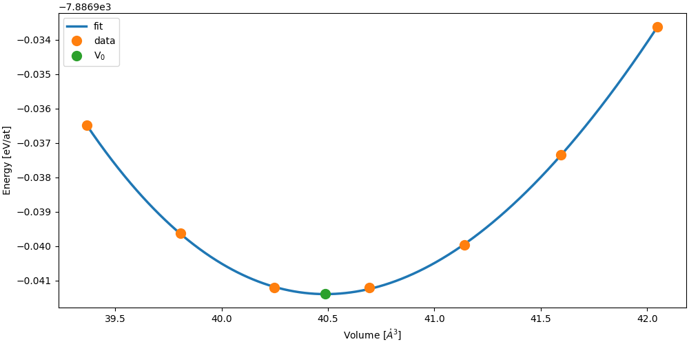
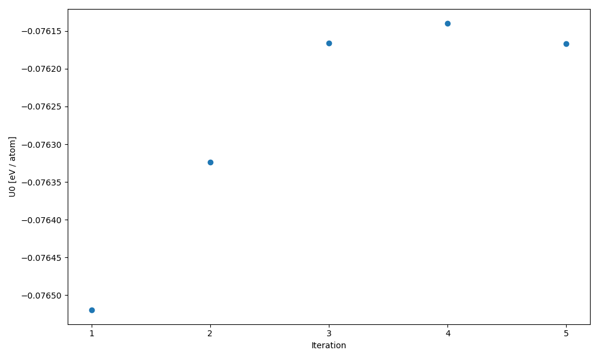
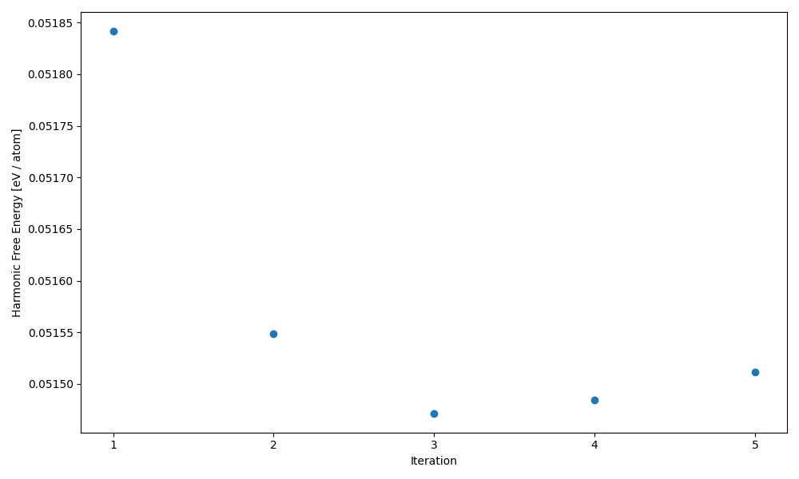
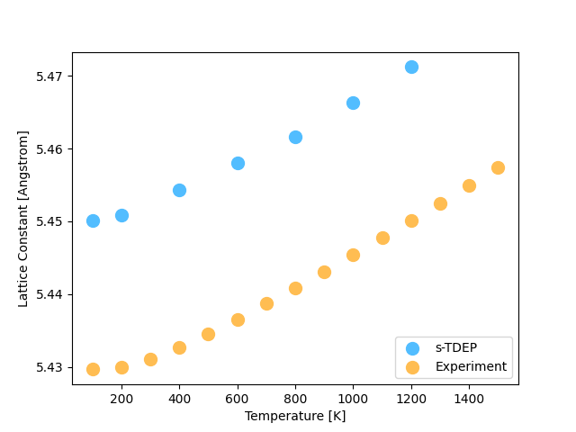
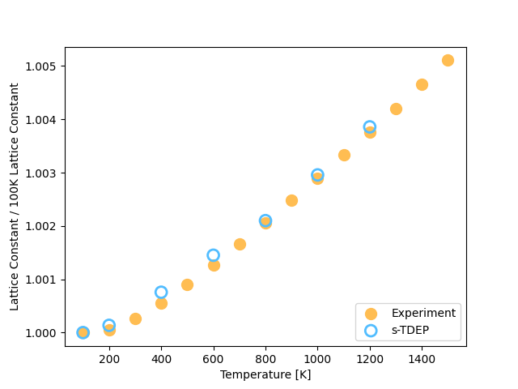

Thermodynamics with TDEP
========================

The free energy is a central property in statistical physics that makes it possible to assess the stability of a structure, find its equilibrium volume, compute phase diagrams and many other things.
For an arbitrary system with a potential $V(\vec{R})$, the free energy is very difficult to compute and requires complex and expensive method.

Fortunately, in the harmonic approximation, the free energy can computed exactly from the partition function
```math
Z_{\text{harmonic}} = \prod_{\lambda}\exp\left(-\frac{\hbar\omega_{\lambda}}{2k_BT}\right)\left[1-\exp\left(-\frac{\hbar\omega_{\lambda}}{k_BT}\right)\right]
```

The harmonic free energy, $\mathcal{F}_0$, naturally follows from the partition function.
```math
\mathcal{F}_0 = -k_BT\log(Z_{\text{harmonic}}) = \sum_{\lambda}\left(\frac{\hbar\omega_{\lambda}}{2} + k_BT\log\left(1-\exp\left(-\frac{\hbar\omega_{\lambda}}{k_BT}\right)\right)\right)
```

In TDEP the harmonic free energy is actually evalulated by integreating the phonon density of states.
```math
\mathcal{F}_0 = k_BT \int_0^\infty d\omega g(\omega) \ln\big[2 \sinh(\frac{\hbar\omega}{2k_BT})\big] 
```

The free energy of the system at any temperature can be obtained using this formula with a given set of phonons.
However, by definition, the harmonic approach is missing the **anharmonic** contribution, which can dramatically modify the thermodynamics of the sytem.

Fortunately TDEP is able to bring some corrections that include part of the anharmonicity [Ref. 2].
For given volume and temperature, and staying at the second order in the force constants, the TDEP free energy $\mathcal{F}^{\mathrm{TDEP}}$ is given by
```math
\mathcal{F}^{\mathrm{TDEP}}(T) = \mathcal{F}_0^{\mathrm{TDEP}}(T) + < V(\vec{R}) - V^{\mathrm{TDEP}}(\vec{R}) >_T = \mathcal{F}_0^{\mathrm{TDEP}}(T) + U_0
```
For more details on this equatoin checkout the [THEORY.md](./THEORY.md) file
In this equation
- $\mathcal{F}_0^{\mathrm{TDEP}}$ is the effective harmonic free energy.
- $V(\vec{R})$ is the potential energy of the system (given for example by DFT).
- $V^{\mathrm{TDEP}}(\vec{R})$ is the potential energy of the effective harmonic model.
- $< O >_T$ indicate an average of $O$ computed at a temperature T.

Compared to the harmonic approximation, two corrections are to be observed
* The temperature dependence of the phonons -> that will bring a modification of the $\mathcal{F}_0(T)$
* The $U_0 = < V(\vec{R}) - V^{\mathrm{TDEP}}(\vec{R}) >_T$ term -> a anharmonic correction

In this tutorial, we will have a look on the convergence of both contributions.
An important thing to have in mind, is that both will have a different rate of convergence.
The harmonic free energy is computed using the interatomic force constants. For each configurations, $3 N_{\mathrm{at}}$ data point will contribute to the computation of the force constants, hence to the computation of $\mathcal{F}_0^{\mathrm{TDEP}}$
On the contrary, a configuration gives only one value to contribute to the $U_0$ correction term.
As we will see, this difference is important in the convergence of the total free energy !


It should be noted that the free energy computed this way is still an approximation.
However, compared to the harmonic approximation, explicit temperature effects are included.
Moreover, if using the self-consistent stochating sampling with a Bose-Einstein distribution (see tutorial on stochastic sampling) this approach allows to include nuclear quantum effects.


**Important Note**

To generate configurations used in TDEP, we have two approaches :
- Using molecular dynamics to sample the true (but classical) distribution (MD-TDEP)
- Using the self-consistent stochastic approach (sTDEP)

[sTDEP is an application of the self-consistent harmonic approximation, constructed on an inequality called the Gibbs-Bogoliubov.](https://github.com/flokno/notes/blob/main/tdep/note_tdep_self-consistent-sampling.md)
This inequality tells us that the sTDEP free energy is an **upper-bound** to the free energy : $\mathcal{F} \leq \mathcal{F}^{\mathrm{sTDEP}}$

On the contrary, using the real distribution, MD-TDEP gives a **lower-bound** to the free energy : $\mathcal{F} \geq \mathcal{F}^{\mathrm{MD-TDEP}}$

In the end, the real free energy is framed by the approximated free energy computed with each approach
```math
\mathcal{F}^{\mathrm{MD-TDEP}} \leq \mathcal{F} \leq \mathcal{F}^{\mathrm{sTDEP}}
```

But be careful ! When comparing the free energy of two phases, to compute phase diagram for example, you have to use **the same approximation** for both phases !

**Important Note 2**

The free energy computed with imaginary mode has no physical meaning !
Always check the dispersion relation before even thinking about computing thermodynamic properties !

## General scope

This tutorial covers:

1. Obtaining the effective harmonic free energy as well as the $U_0$ correction
2. Converging the free energy when using stochastic sampling
3. Computing equilbrium volumes at finite temperature using the equation of state fitting method
4. Calculating the thermal expansion


The end goal of this tutorial is to compute the lattice parameters of silicon in order to approximate the thermal expansion of silicon. When computing properties at finite temperature, thermal expansion can have a significant impact, thus making the prediction of the equilibrium volume an important step.
When working at fixed temperature, the equilibrium volume can be computed using a model equation of state to fit potential energy vs volume data.
For example, here is the equation of state of silicon fitted with the Vinet model.
<p align="center">
	
  <figcaption><center><em>Equation of state of bcc Zr computed without effects of temperature.</a></em></center></figcaption>
</p>

To include the effects of temperature, we can use the equation of state method, but replacing the energy by the free energy in the fitting. 

More dtails concerning free energy can be ound on the docs pages for [`extract_forceconsants`](http://ollehellman.github.io/program/extract_forceconstants.html) and [`phonon_dispersions`](https://ollehellman.github.io/program/phonon_dispersion_relations.html#sec_tdepthermo)


## Computing the Free Energy (basic example)

To start, we will compute the free energy of BCC zirconium with a lattice parameter of 3.61 $\mathring{A}$.
In the `example_Zr` folder, you will find a subdirectory `a3.61_1300K` which all the necessary input files to compute the free energy with TDEP. The configurations were generated using the sTDEP approach using the [`canonical_configuration`](https://tdep-developers.github.io/tdep/program/canonical_configuration/) binary at a temperature of 1300 K. To calculate the TDEP free energy we will use the later iteration.

1. Change directory to `example_Zr/a3.61_1300K/iter.012`.
2. Compute the second-order force constants and re-name the output to use the IFCs as input for the free energy calculation. This command should take a few seconds to run and will generate the `outfile.forceconstant` and `outfile.U0` files.
```
extract_forceconstants -rc2 10.0 -U0
mv outfile.forceconstant infile.forceconstant
```
Expected U0:
```sh
    BASELINE ENERGY (eV/atom):
        U0:             -98782.253022
```
3. Compute the phonon dispersion, density of states and other (harmonic) thermodynamic properties at 1300K. This should take about 1 second and will generate the `outfile.free_energy` file. **For consistency, it is important to compute thermodynamic properties at the temperature at which the configurations were generated !** 
```sh
phonon_dispersion_relations --dos --temperature 1300
```
Expected Output:
```sh
T(K)     F(eV/atom)         S(eV/K/atom)       Cv(eV/K/atom)
1300.00000 -0.73434817276E+00  0.82376351069E-03  0.25815978923E-03
```

The `phonon_dispersion_relations` command calculates harmonic thermodynamic properties from the second-order force constants. First the phonons are calculated from the dynamical matrix and the free energy is evaluated. Equations for entropy and heat capacity can be obtained by differenting the harmonic free energy expression. Walking through the output from TDEP we can see exactly what the code is doing. If you want even more detail the source code always contains the truth. 


We now have all we need to compute the TDEP free energy! The `oufile.free_energy` contains harmonic free energy (column 2) and the `outfile.U0` contains the temperature dependent estimate of $U_0$. To get the free energy with the second order correction, you just have to add the harmonic free energy in `outfile.free_energy` and the second order correction in `outfile.U0` (the second value). The `outfile.U0` will also contain high-order corrections, but since our reference free energy is from a harmonic system we can only use the harmonic correction for $U_0$. The resulting free energy will be in eV/atom.

In this case $F_{\text{TDEP}} = \langle V(R) - V_2(R) \rangle + F_{\text{vib}} = U_0 + F_{\text{vib}}$ = -98782.253022 + -0.7343481 = - 98782.98737


## Free Energy Convergence and Temperature Dependent Lattice Parameters

To better understand free energy convergence and thermal expansion we will calculate the equilibrium lattice constants. To estimate the lattice parameters we need to find the equilibrium volume by minimizing the free energy at several tempeartures. To speed things up data is provided for all but one of the volume temperature combinations. You will converge the free energy at 100K temeprature for silicon with a lattice constant of 5.40. The remainder of the data is provided as it just involves repeating the process on a grid of temperature and volume.

First we need to unzip the provided data:
```sh
cd ../../../example_Si/ 
tar -xzvf data.tar.gz
```

We will step through the first tempearture, 100K, manually. Start by entering the `a5.40/T100` directory. **Note that the `infile.ucposcar` and potential is all we need to start!**
```sh
cd ./a5.40/T100
cp ../infile.ucposcar ./
```

Much of this workflow will mimic the sampling tutorial, don't hesitate to go back to that tutorial to get more details on some of the steps. Since we only start with an `infile.ucposcar` we need to generate a supercell first. Silicon has a dimonad lattice with 8 atoms per conventional cell. So a 3x3x3 cubic supercell will have 216 atoms. 
```sh
generate_structure -na 216
mv outfile.ssposcar infile.ssposcar
```

Next we will leverage the `run_sTDEP.sh` script from the sampling tutorial. This automates the process of self-consistently looping to obtain force constants. Since we are using silicon now we need to set some of the parameters. Specifically, set the second-order force constant cutoff to 8.0 angstroms and the maximum freuqency to 17 THz. In practice another study should be done to ensure the force constant cutoff is converged. For today, 8.0 will work (and is probably overkill). Furthermore, the number of iterations until convergence cannot be known a priori. We will start with 5, but could refine this guess later depending on convergence. 
```sh
bash ../../../../02_sampling/sTDEP/scripts/run_sTDEP.sh --niter 5 --maximum_frequency 17.0 --temperature 100 --cutoff 8.0
```

The sTDEP algorithm will take a few minutes to run. Once it is complete we can assess the convergence of U0 and the free energy. The `scripts` folder contains the necessary code to create the convergence plots, but we need to compute the free energies first. U0 was already calculated by the `run_sTDEP.sh` script. 
```sh
for ii in $(seq 1 5); do
    printf -v jj "%03d" $ii
    folder=iter.$jj
    cd $folder

    phonon_dispersion_relations --dos --temperature 100

    cd ../
done
```

Now we have all the free energy and U0 data to asses convergence. From the `T100` directory run the provided plotting script:
```sh
python ../../../scripts/plot_dos.py --convergence --basepath=$(pwd)
```

This will create 3 plots: `convergence_of_Harmonic_Free_Energy.png`, `convergence_of_U0.png` and `DOS_convergence.png`. Remeber that converging free energy to 1 meV/atom is a good goal. Open the plots at various temperatures and try to answer these questions:
- Do you think we've reached convergence? 
- Which property do you expect to converge first? Why?
- Could we get away with running fewer sampling iterations?

Here is an example of some of the $U_0$ and $F_0$ plots at 200K and a = 5.40:

<div style="display: flex; justify-content: center; align-items: center; gap: 20px;">
  <div>
    
    <figcaption style="text-align: center;"><em>U0 convergence at 200K and a = 5.40</em></figcaption>
  </div>
  <div>
    
    <figcaption style="text-align: center;"><em>F0 convergence at 200K and a = 5.40</em></figcaption>
  </div>
</div>


The remaining temperatures are calculated for you. The script to loop over temperature, run sTDEP, and create the convergence plots is in the `scripts` directory if you want to run more temperatures or play with the settings. If you open the `run.sh` script you will see several parameters hard coded at the top for silicon. Try running more temepartures or changing the number of iterations. This script takes in the directory which must contain the `infile.ucposcar` and a list of temperatures to calculate.
```sh
sh ../scripts/run.sh a5.40 400 600 800
```

## Getting the Equilibrium Volume

Now that the free energy for every volume has been computed, we can finally compute the equilibrium volume. To get the equilibrium volume we choose the volume which corresponds to the mimimum free energy. So we must:

1. Extract the total free energy of each volume and temperature (at the final iteration)
2. Fit a Vinet equation of state (EOS) for each temeprature. Note that because of statistical noise, the fit might not work for some iterations without enough data.

The Vinet EOS is Eqn 1. in [this](https://journals.aps.org/prb/abstract/10.1103/PhysRevB.70.224107) paper. There are several free parameters: the bulk modulus at zero pressure $B_0$ its derivative with respect to pressure, $B_0^\prime$, the total energy at zero pressure $E_0$ and the volume at zero pressure, $V_0$.

We already have all of this data and just need to do the fit! A script to parse and plot the relevant data is provided. The script will fit the Vinet equation of state to the data at each temperature for the final iteration. There are several values hard coded in this script, if you wish to adapt it you will need to change those variables.
```sh
# cd to `example_Si` folder
cd ../../
python ../scripts/equation_of_state.py
```

This script will create a lot of plots and data files. The `eos_results_{T}.dat` files contain the fitted parameters at each temperature and the `vinet_{T}.png` plot each fit. The interesting plots are `lattice_constant.png` and `lattice_constant_scaled.png` in the `example_Si` folder that should look something like this:
- Can you think of any reasons why our lattice constants do not match exactly?
<p align="center">
	
  <figcaption><center><em>TDEP prediction of silicon lattice constants.</a></em></center></figcaption>
</p>

If we normalize each plot by the lattice constant at 100K we see that the trend predicted by So3krates and s-TDEP agrees very well with the experimental data! This means we should be able to get a good estimate for the thermal expansion.

<p align="center">
	
  <figcaption><center><em>TDEP prediction of silicon lattice constants.</a></em></center></figcaption>
</p>

To answer the earlier question, some possible reasons for the deviation are:

1. So3krates potential does not perfectly match real silicon. 
2. Higher order anharmonic effects not captured by $U_0$ or $F_{ha}$.
3. Non-convergence of $U_0$ or $F$ (i.e., run more sTDEP iterations). This could be especially true at higher temperatures
4. Supercell size is too small

For a more careful calculation the silicon's thermal expansion check out [this](https://doi.org/10.1073/pnas.1707745115) paper which uses sTDEP and DFT to capture the anomolous negative thermal expansion in silicon. 

## Thermal Expansion

The linear thermal expansion can be approximated by numerically differentiating the lattice constant with respect to temperature. Ideally, a functional form is fit to the lattice constant or volume data which can be analytically differentiated as numerical derivatives amplify noise. For the purposes of this tutorial, we can estimate the linear thermal expansion as:

$$\alpha = \frac{1}{L}\frac{dL}{dT} \approx \frac{1}{L(T)}\frac{L(T+\Delta T) - L(T-\Delta T)}{2\Delta T}$$

Let's estimate the linear thermal expansion at 600K. The lattice constants can be found in the `equilibrium_lattice_constants.txt` file created by `equation_of_state.py`. You should get roughly `3.353e-06 1/K` which is a bit of an underestimate of the true thermal expansion `3.842e-06 1/K`. Note that your number will be slightly different since the sampling procedure is random.

If you're curious, the values at the other temperatures where we have enough data to calculate the derivative are:

| Temperature [K] | s-TDEP [1/K] | Experiment [1/K] |
|:----------:|:----------:|:----------:|
| 400   | 3.285e-06     | 3.253e-06     |
| 600    | 3.353e-06     | 3.842e-06    |
| 800    | 3.758e-06     | 4.151e-06    |
| 1000    | 4.38364e-06    | 4.260e-06    |

More accurate predictions can be obtained by using DFT in place of So3krates and by ensuring convergence of U0 and F0.

## Suggested reading

- [[1] O. Hellman, I. A. Abrikosov, and S. I. Simak Phys. Rev. B **84**, 180301\(R\) (2011)](https://journals.aps.org/prb/abstract/10.1103/PhysRevB.84.180301)
- [[2] O. Hellman, P. Steneteg, I. A. Abrikosov, and S. Simak, Phys. Rev. B **87**, 104111 (2013)](https://journals.aps.org/prb/abstract/10.1103/PhysRevB.87.104111)
- [[3] D.S. Kim, O. Hellman, et. al, Proc. Natl. Acad. Sci. U.S.A. 115 (9) 1992-1997, (2018)](https://doi.org/10.1073/pnas.1707745115)

## Prerequisites

- [TDEP is installed](https://github.com/tdep-developers/tdep/blob/main/INSTALL.md)
- So3krates Potential (see tutorial 0)
