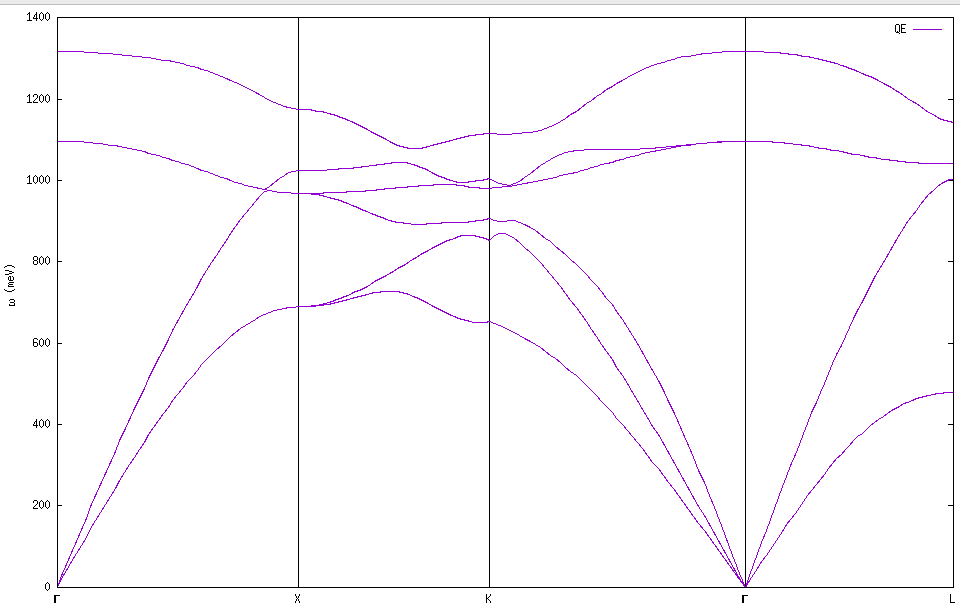
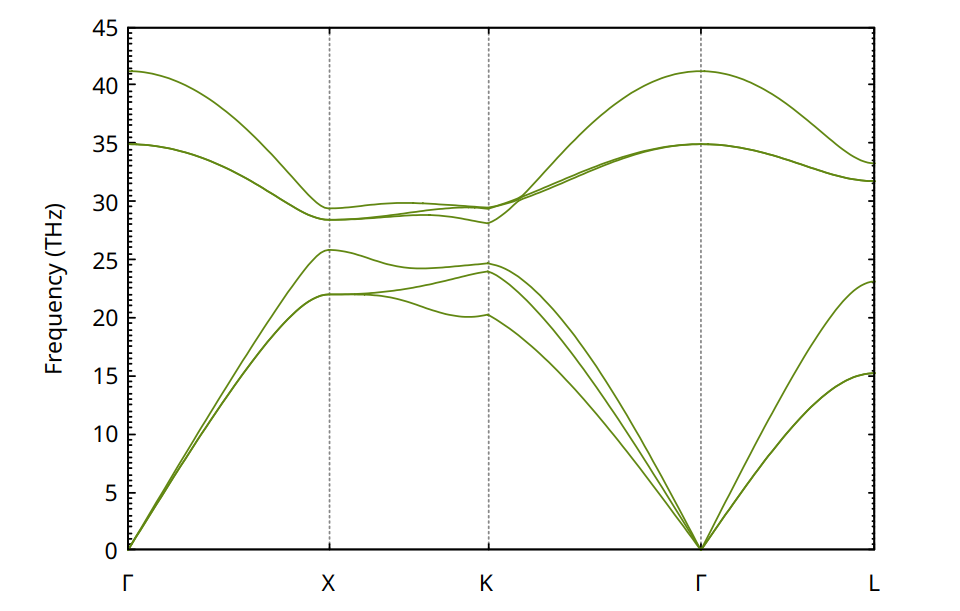

Carrier conductivity including anharmonic effects with TDEP and EPW
===

This tutorials cover how to compute the drift and Hall mobility of c-BN using the Boltzmann transport equation (BTE) within the [EPW code](https://epw-code.org) and including anharmonic effects computed with sTDEP.
The theory for the BTE can be found in the review [[Ponce2020]](#suggested-reading).

We will show how to compute the harmonic phonon dispersion of c-BN using density functional perturbation theory (DFPT) with [Quantum ESPRESSO](https://www.quantum-espresso.org/), the anharmonic temperature dependent phonon dispersion using stochastic TDEP and to convert the effective harmonic interatomic force constants (IFC) into real-space Quantum ESPRESSO XML format.
We will then use these to compute transport properties with the [EPW code](https://epw-code.org).

For the description of inputs and more information please follow the link:
- [TDEP inputs](https://tdep-developers.github.io/tdep/files/)
- [Quantum ESPRESSO inputs](https://epwdoc.gitlab.io/source/doc/Inputs.html)
- [EPW inputs](https://epwdoc.gitlab.io/source/doc/Inputs.html)

The TDEP to Quantum ESPRESSO interface is described in [[Yin2025]](#suggested-reading).

## Theory

In this example we are going to calculate the drift and Hall hole carrier mobility of c-BN.
The drift mobility is obtained with:

$$
\mu_{\alpha\beta}^{\mathrm{d}} = \frac{-1}{V^{\mathrm{uc}}n^{\mathrm{c}}} \sum_{n}  \int  \frac{\mathrm{d}^3 k}{\Omega^{\mathrm{BZ}}} v_{n\mathbf{k}\alpha} \partial_{E_{\beta}} f_{n\mathbf{k}}
$$

where the out of equilibrium occupations are obtained by solving the BTE:

$$
\partial_{E_{\beta}} f_{n\mathbf{k}} = e v_{n\mathbf{k}\beta} \frac{\partial f^0_{n\mathbf{k}}}{\partial \varepsilon_{n\mathbf{k}}} \tau_{n\mathbf{k}} + \frac{2\pi \tau_{n\mathbf{k}}}{\hbar}  \sum_{m\nu} \int \frac{\mathrm{d}^3 q}{\Omega^{\mathrm{BZ}}} | g_{mn\nu}(\mathbf{k},\mathbf{q})|^2 \Big[(n_{\mathbf{q}\nu}+1-f_{n\mathbf{k}}^0)\delta(\varepsilon_{n\mathbf{k}}-\varepsilon_{m\mathbf{k}+\mathbf{q}}  + \hbar \omega_{\mathbf{q}\nu} ) +  (n_{\mathbf{q} \nu}+f_{n\mathbf{k}}^0)\delta(\varepsilon_{n\mathbf{k}}-\varepsilon_{m\mathbf{k}+\mathbf{q}}  - \hbar \omega_{\mathbf{q}\nu} ) \Big]  \partial_{E_{\beta}} f_{m\mathbf{k}+\mathbf{q}}.
$$

The scattering rate is defined as:

$$
\tau_{n\mathbf{k}}^{-1} \equiv  \frac{2\pi}{\hbar} \sum_{m\nu} \int \frac{d^3q}{\Omega_{\mathrm{BZ}}} | g_{mn\nu}(\mathbf{k,q})|^2 \big[ (n_{\mathbf{q}\nu} +1 - f_{m\mathbf{k+q}}^0 )   \delta( \varepsilon_{n\mathbf{k}}-\varepsilon_{m\mathbf{k}+\mathbf{q}} - \hbar \omega_{\mathbf{q}\nu}) +  (n_{\mathbf{q}\nu} +   f_{m\mathbf{k+q}}^0 )\delta( \varepsilon_{n\mathbf{k}}-\varepsilon_{m\mathbf{k}+\mathbf{q}} +  \hbar \omega_{\mathbf{q}\nu}) \big].
$$

A common approximation to Eq.~\eqref{eq:eqBTE} is called the self-energy relaxation time approximation (SERTA) and consists in neglecting the second term in the right-hand of the equation which gives:

$$
\mu_{\alpha\beta}^{\mathrm{SERTA}} = \frac{-e}{V^{\mathrm{uc}}n^{\text{c}}} \sum_{n}  \int \frac{\mathrm{d}^3 k}{\Omega^{\mathrm{BZ}}} \frac{\partial f^0_{n\mathbf{k}}}{\partial \varepsilon_{n\mathbf{k}}}  v_{n\mathbf{k}\alpha} v_{n\mathbf{k}\beta} \tau_{n\mathbf{k}}.
$$

The the low-field phonon-limited carrier mobility in the presence of a small finite magnetic field **B** is given by:

$$
\mu_{\alpha\beta}(B_\gamma) = \frac{-1}{V^{\mathrm{uc}}n^{\text{c}}} \sum_{n} \int \frac{\mathrm{d}^3 k}{\Omega^{\mathrm{BZ}}} v_{n\mathbf{k}\alpha} [\partial_{E_{\beta}} f_{n\mathbf{k}}(B_\gamma) - \partial_{E_{\beta}} f_{n\mathbf{k}}],
$$

again solving the BTE with finite (small) magnetic field:

$$
\Big[1 - \frac{e}{\hbar} \tau_{n\mathbf{k}} (\mathbf{v}_{n\mathbf{k}} × \mathbf{B}) · \nabla_{\mathbf{k}} \Big] \partial_{E_{\beta}} f_{n\mathbf{k}}(B_{\gamma}) =
$$

$$
\big[1 - \frac{e}{\hbar} \tau_{n\mathbf{k}} (\mathbf{v}_{n\mathbf{k}} × \mathbf{B}) · \nabla_{\mathbf{k}} \big] \partial_{E_{\beta}} f_{n\mathbf{k}}(B_{\gamma}) =
$$

$$
(\mathbf{v}_{n\mathbf{k}} \times \mathbf{B}) · \nabla_{\mathbf{k}}
$$

$$
(\mathbf{v}_{n\mathbf{k}}
$$

$$
\mathbf{B}) ·
$$

$$
\nabla_{\mathbf{k}}
$$

$$
\partial_{E_{\beta}} f_{n\mathbf{k}}(B_{\gamma})
$$

$$
\Big[1 - \frac{e}{\hbar}\tau_{n\mathbf{k}} (\mathbf{v}_{n\mathbf{k}} \times \mathbf{B}) · \nabla_{\mathbf{k}} \Big] \partial_{E_{\beta}} f_{n\mathbf{k}}(B_{\gamma}) = e v_{n\mathbf{k}\beta} \frac{\partial f_{n\mathbf{k}}^0}{\partial \varepsilon_{n\mathbf{k}}} \tau_{n\mathbf{k}} + \frac{2\pi \tau_{n\mathbf{k}}}{\hbar} \sum_{m\nu} \int \frac{\mathrm{d}^3 q}{\Omega^{\mathrm{BZ}}} | g_{mn\nu}(\mathbf{k},\mathbf{q})|^2  \Big[(n_{\mathbf{q}\nu} + 1 - f_{n\mathbf{k}}^0)\delta(\varepsilon_{n\mathbf{k}} - \varepsilon_{m\mathbf{k} + \mathbf{q}} + \hbar \omega_{\mathbf{q}\nu}) + (n_{\mathbf{q} \nu} + f_{n\mathbf{k}}^0) \delta(\varepsilon_{n\mathbf{k}} - \varepsilon_{m\mathbf{k} + \mathbf{q}} - \hbar \omega_{\mathbf{q}\nu}) \Big] \partial_{E_{\beta}} f_{m\mathbf{k}+\mathbf{q}}(B_{\gamma}).
$$

The Hall factor and Hall mobility are then obtained as:

$$
r_{\alpha\beta}(\hat{\mathbf{B}}) \equiv \lim_{\mathbf{B} \rightarrow 0} \sum_{\delta\epsilon} \frac{[\mu_{\alpha\delta}^{\rm d}]^{-1} \mu_{\delta\epsilon}(\mathbf{B}) [\mu_{\epsilon\beta}^{\rm d}]^{-1}}{|\mathbf{B}|}
$$

$$
\mu_{\alpha\beta}^{\rm Hall}(\hat{\mathbf{B}}) = \sum_{\gamma} \mu_{\alpha\gamma}^{\rm d} r_{\gamma\beta}(\hat{\mathbf{B}}),
$$


where $\hat{\mathbf{B}}$ is the direction of the magnetic field.

## Preliminary calculations with Quantum ESPRESSO

For this tutorial, you will need to compile [Quantum ESPRESSO](https://www.quantum-espresso.org/) v7.4 and we will assume that the following executables are in your path: `pw.x, ph.x, q2r.x, matdyn.x, epw.x`.

First, go to the folder `example_cBN`

Then download the standard boron and nitrogen PBE pseudopotential from [PseudoDojo](https://www.pseudo-dojo.org/) in upf format and renamed them `B-PBE.upf` and `N-PBE.upf`
and place them in the `example_cBN` folder.

1. Perform a self-consistent calculation
   ```bash
   cd 1_qe/
   mpirun -np 4 pw.x -in scf.in | tee scf.out
   ```
Note that in practice the **k**-point grid needs to be fairly large in order to get converged dielectric function and Born effective charges during the following phonon calculation.

2. Compute the phonon using DFPT on a coarse 4x4x4 **q**-point grid
   ```bash
   mpirun -np 4 ph.x -in ph.in | tee ph.out
   ```
Note that the input variable `epsil=.true.` computes the macroscopic dielectric constant in non-metallic systems. If you add `.xml` after the name of the dynamical matrix file, it will produce the data in XML format (preferred). The variable `fildvscf` is required as it generates the perturbed potential. It is also important that `tr2_ph` is very small as it control the threshold for the self-consistent first-order perturbed wavefunction.

**Task**: locate in `ph.out` the IBZ q-point grid, dielectric function and Born effective charge tensor. Note that denser **k**-point grids are required to obtain converged quantities.

3. Run the python post-processing script to create the save folder, used later by EPW (the script is located in `QE/EPW/bin/pp.py` but copied here for convience).
   ```bash
   python3 pp.py
   ```
The script will ask you to enter the prefix used for the calculation. In this case enter `bn`. The script will create a new folder called `save` that contains the dvscf potential files, pattern files, and dynamical matrices on the IBZ.

## Create the IFC and interpolate the phonons along high-symmetry path

1. Do a Fourier transform from the dynamical matrices into real space to produce `bn444.fc.xml` then interpolate on a high-symmetry lines to get the phonons
   ```bash
   q2r.x < q2r.in | tee q2r.out
   ```

2. Interpolate the real space IFC in Bloch space along high-symmetry lines
   ```bash
   matdyn.x < matdyn.in | tee matdyn.out
   ```

3. Use gnuplot (or any other tools) to show the resulting phonon dispersion
   ```bash
   gnuplot gnuplot.in
   ```
You should obtain a dispersion similar to:

<p>
        
  <figcaption><center><em>Fig. 1: Harmonic phonon dispersion of c-BN using Quantum ESPRESSO and DFPT</em></center></figcaption>
</p>

## TDEP anharmonic calculations

1. Create the primitive and supercell inputs. For this you need to create the `infile.ucposcar` from the Quantum ESPRESSO calculation made in the step above. We provide the file for you in this tutorial.
**Note**: the lattice parameter in `infile.ucposcar` **must be** expressed in Angstrom.

  Then execute:
   ```bash
   cd ../2_tdep
   tdep/bin/generate_structure -na 10 --output_format 6
   ```
where `output_format 6` is a new Quantum ESPRESSO output format (**you need TDEP v25.04 or higher**) and it should generate a file called `outfile.supercell_qe`.

2. Create the LOTO file from the output of the QE ph.out file. We provide it in the file `infile.lotosplitting`

3. Choose a temperature you want to study, we choose 600 K
   ```bash
   mkdir sampling.600K
   cp outfile.ssposcar infile.ssposcar
   cp infile.ssposcar sampling.600K/
   cp infile.ucposcar sampling.600K/
   cp infile.lotosplitting sampling.600K/
   cd sampling.600K
   ```

4. Generate 1 configuration at 600 K. Since it is quantum, the temperature will not match perfectly.
   ```bash
   tdep/bin/canonical_configuration --quantum --maximum_frequency 20 --temperature 600 -n 1 --output_format 6
   mkdir -p iter.000/samples/sample.00001/
   cd iter.000/samples/sample.00001/
   ```

5. Then you should copy your `scf.in` input and merge it with the `qe_conf0001` file produced in the previous step.
Importantly the calculation of forces should be enabled in the input. We provide the file `scf.in` for reference.
   ```bash
   pw.x -np 4 -in scf.in | tee scf.out
   ```

6. Extract forces from QE output
In principle you can extract yourself the forces and atomic coordinate from the scf.out, following the convention for TDEP given in [HERE](https://tdep-developers.github.io/tdep/files/).

However, it is simpler to use:
   ```bash
   pip install https://github.com/flokno/tools.tdep/archive/refs/tags/v0.0.5.zip
   ```

You can then just run the extraction script:
   ```bash
   cd ../../
   tdep_parse_output samples/*/scf.out --format espresso-out
   cp ../infile.ucposcar .
   cp ../infile.ssposcar .
   cp ../infile.lotosplitting .
   ```

7. Create the file with the **q**-point path `infile.qpoints_dispersion` that we also provide for reference.

You can then extract the force constant
   ```bash
   tdep/bin/extract_forceconstants  --polar -rc2 4 | tee extract_forceconstants.log
   cp outfile.forceconstant infile.forceconstant
   tdep/bin/phonon_dispersion_relations -rp
   ```
which should give you the TDEP phonon dispersion after a single iteration with a single configuration:

<p>
        
  <figcaption><center><em>Fig. 2: Anharmonic phonon dispersion of c-BN using TDEP at 600 K</em></center></figcaption>
</p>


## Suggested reading
- [[Ponce2020] S. Poncé, W. Li, S. Reichardt and F. Giustino, Reports on Progress in Physics **83**, 036501 (2020)](https://iopscience.iop.org/article/10.1088/1361-6633/ab6a43)
- [[Yin2020]  J. Yin, O. Hellman, and S. Poncé, arXiv:2505.20092 (2025)](https://doi.org/10.48550/arXiv.2505.20092)
